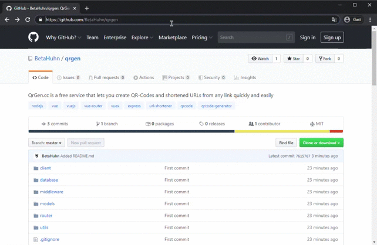

# qrgen.cc - QR-Code generator/url-shortener
[](https://travis-ci.org/BetaHuhn/qrgen) [](https://coveralls.io/github/BetaHuhn/qrgen?branch=master)

QrGen.cc is a free service that lets you create QR-Codes and shortened URLs from any link quickly and easily



## Live Website

The live version of this project can be found here: https://qrgen.cc

## Introduction

This repo contains the source code for the [qrgen.cc](https://qrgen.cc) QR-Code generator/url-shortener. Just add qrgen.cc/ infront of a url and get a QR-Code aswell as a short url. Alternatively you can visit [qrgen.cc](https://qrgen.cc) and create them manually.
The website is build with a Node.js/Express backend and a vue.js frontend. The built vue.js files are hosted by the express server.

## Note
There is also a Chrome/Firefox extension available. It lets you create a QR-Code/short URL by simply pressing the icon in your browser, or even with a keyboard shortcut. More info [here](https://github.com/BetaHuhn/qrgen-extension)

## Installation

Download the repo:

```
git clone https://github.com/BetaHuhn/qrgen
```

Change directory:

```
cd qrgen
```

Create .env file:

```
nano .env
```

Add:

```
DB_CONNECTION_STRING=Your MongoDB connection string; defaults to mongodb://localhost:27017/qrgen
PORT=Port the server runs on; defaults to 3000
```

Install dependencies:

```
npm run dependencies
```

Build backend and frontend:

```
npm run build
```

Start app:

```
npm run start
```

## Authors
* **Maximilian Schiller** ([@BetaHuhn](https://github.com/BetaHuhn)) - *Initial work*
* **Alexander Janke** ([@alexanderjanke](https://github.com/alexanderjanke)) - *Typescript*

## License

This project is licensed under the MIT License - see the [LICENSE.md](LICENSE.md) file for details
